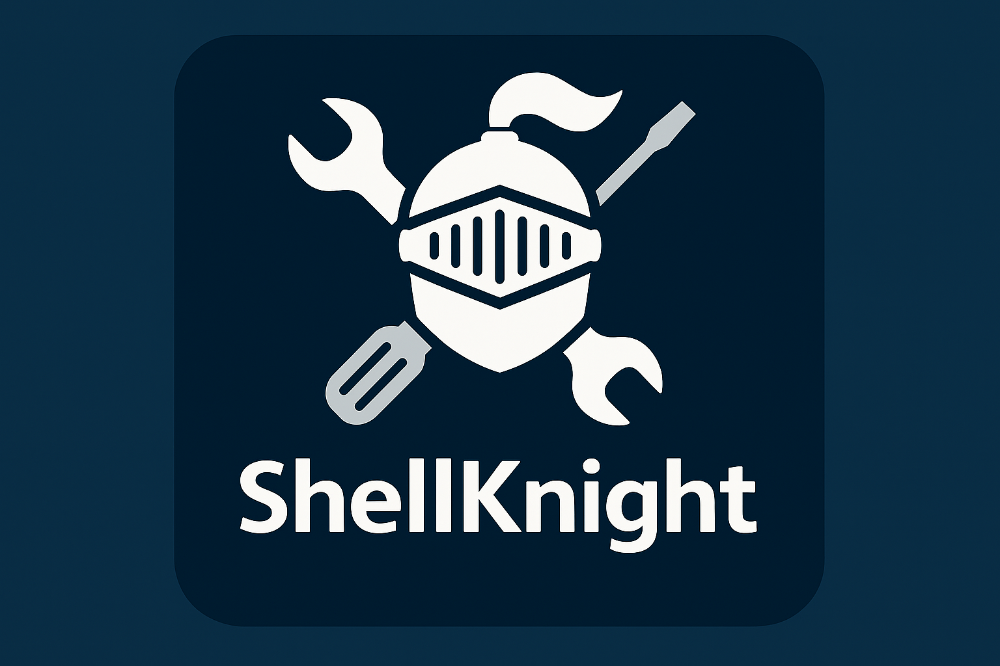

  

<h1 align="center">ShellKnight</h1>

  Advanced PowerShell remediation and system cleanup toolkit  

  ⚔️ PUP Removal · 🧠 IOC Detection · 🧰 System Repair · ⚙️ Automation

---

## ⚔️ What is ShellKnight?

ShellKnight is not a demo script collection.

It is a **real-world remediation engine** built from operational experience—designed to detect, clean, and report on compromised or degraded Windows systems.

If it exists here, it solved a real problem.

---

## 🔥 Core Tool: CleanSweep Engine

At the heart of ShellKnight is:

> **Dave’s CleanSweep v0.66**

A **21-phase remediation pipeline** designed for:

- MSP / RMM deployments  
- Incident response  
- System cleanup & stabilization  
- IOC-driven threat detection  

---

## 🧠 What Makes It Different

This is NOT:
- a simple cleanup script  
- a generic malware remover  
- a “delete temp files” tool  

This IS:

- ✅ **Phase-based remediation engine (21 stages)**
- ✅ **Dynamic threat intelligence integration (Neo23x0 + MalwareBazaar)**
- ✅ **Multi-layer persistence removal**
- ✅ **StrictMode-safe PowerShell across PS 3.0 → 7.x**
- ✅ **Zero interaction automation (production ready)**

---

## ⚙️ Capabilities

### 🛠️ System Remediation
- Process termination (PUP/adware patterns + dynamic IOC matching)
- Filesystem cleanup (targeted artifact removal)
- Service + scheduled task removal (CIM-native, no legacy tools)
- Registry persistence cleanup (Run/RunOnce, uninstall hives)

---

### 🧬 Threat Detection
- Dynamic IOC ingestion (hash, filename, C2)
- MalwareBazaar hash lookups + fallback layers
- Defender integration for unknown binaries
- Trojan family detection (29+ known RAT/stealer groups)

---

### 🧠 Persistence & Abuse Detection
- WMI persistence auditing
- Browser policy hijack cleanup
- Hosts file C2 detection (with RFC1918 protection)
- Event log IOC correlation (4688, 7045)

---

### 💾 System Recovery
- Disk cleanup (safe-mode approach)
- Windows Update cache repair
- Temp + log + artifact cleanup
- Disk usage / system state reporting

---

### 📊 Reporting
- Structured logging system
- HTML executive reports
- IOC / failure / remediation breakdown
- Environment + system metrics

---

## ⚔️ Execution Model

The engine runs through:

