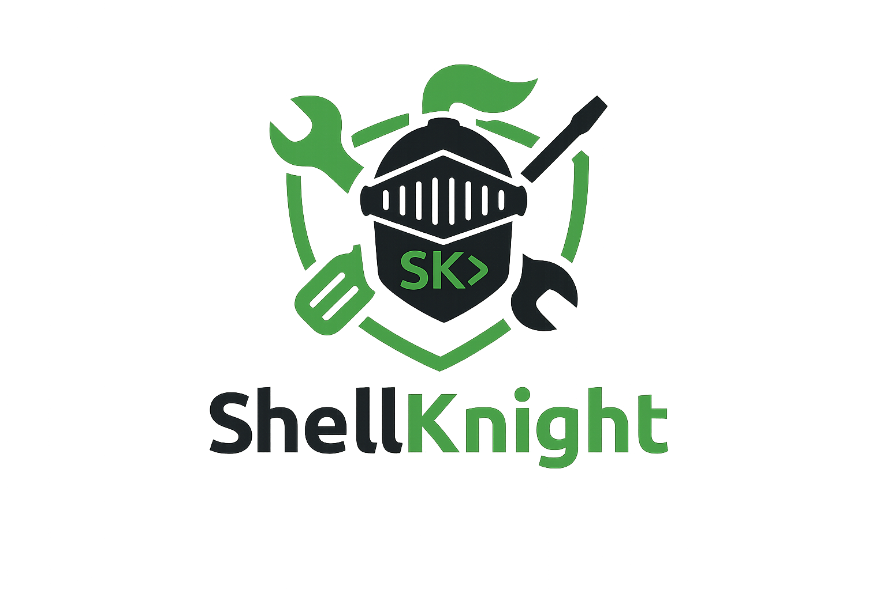

<!-- LOGO (auto switches for GitHub light/dark mode) -->
<p align="center">
  <picture>
    <!-- GitHub dark mode -->
    <source srcset="assets/sk-logo-light.png" media="(prefers-color-scheme: dark)">
    <!-- GitHub light mode -->
    
  </picture>
</p>

<p align="center">
  <picture>
    <source srcset="assets/sk-logo.png">
  </picture>
</p>

<div align="center">
  <h1>Scripts Built for Battle/h1>
  <p><strong>Enterprise Endpoint Security & Remediation Tool</strong></p>

  
  
  
  

  <br>
  <strong>Automated removal of PUPs, browser hijackers, adware, and malware persistence mechanisms.</strong>
</div>

---

## ✨ Features

- **21-phase intelligent remediation pipeline**
- Dynamic IOC downloads from [Neo23x0/signature-base](https://github.com/Neo23x0/signature-base)
- MalwareBazaar SHA256 hash lookup + Defender fallback
- Multi-layered AV/EDR detection (Datto, Huntress, SentinelOne, etc.)
- Professional HTML email reports, JSON output, and Syslog support
- Security & Performance A–F grading system
- PowerShell 3.0 – 7.x compatible (auto-adapts)
- Conservative, low false-positive design built for production MSP/Enterprise use

---

## 📋 Phase Overview

| Phase | Focus | Description |
|-------|-------|-------------|
| 0 | Hardware & OS Detection | System profiling and capability detection |
| 1 | Dynamic Intelligence | Downloads latest hash, filename, and C2 IOCs |
| 2 | Machine Assessment | Health check + Security/Performance grades |
| 3 | Process Termination | Kills PUPs and adware processes |
| 4–14 | Persistence Removal | Registry, services, tasks, browsers, WMI, Hosts, etc. |
| **15** | **Trojan/Malware IOC Detection** | High-severity RAT/stealer hunting |
| 16 | Reboot Check | Detects pending reboots |
| **17** | **Malware Hash Analysis** | MalwareBazaar → Neo23x0 → Defender |
| 18 | Safe Disk Cleanup | Temp, caches, logs (Recycle Bin skipped) |
| 19–21 | Reporting | Recent software, temp age, Event Log IOCs |

### Phase 15 – Trojan / Malware IOC Detection
Scans for serious threats (RATs, stealers, trojans) in risky locations:
- Known malicious folders (`njrat`, `asyncrat`, `redline`, `vidar`, `lokibot`, `qakbot`, etc.)
- Suspicious executables in `%TEMP%`, `C:\Users\Public`, etc.
- **Does NOT auto-delete** — logs as `[IOC]` for analyst review and feeds into Phase 17.

### Phase 17 – Malware Hash Lookups
Deep analysis on flagged files using:
1. **MalwareBazaar** (primary, with API key)
2. Neo23x0 local hash database
3. Windows Defender custom scan

---

## 🚀 Quick Start

```powershell
# Run as Administrator
Set-ExecutionPolicy Bypass -Scope Process -Force
.\ShellKnight.ps1
**Built for MSPs, IT Administrators, and Security Professionals who want clean, well-documented endpoints.**

⭐ If ShellKnight helps you keep machines clean, please star this repository!
```
